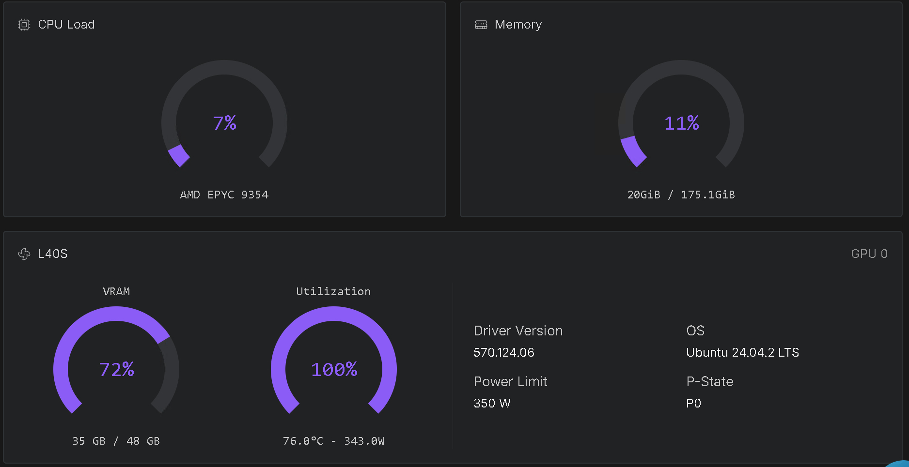

# 🚀 Run Hunyuanvideo 1.x with ComfyUI with provisioning — [RunPod.io Deployment](https://runpod.io?ref=se4tkc5o)

[](https://hub.docker.com/r/ls250824/run-comfyui-hunyuanvideo)

A streamlined and automated environment for running **ComfyUI** with **Hunyuanvideo models**, optimized for use on [RunPod.io](https://runpod.io?ref=se4tkc5o).



## 🔧 Features

- Automatic model and LoRA downloads via environment variables.
- Built-in **authentication** for:
  - ComfyUI
  - Code Server
  - Hugging Face API
  - CivitAI API
- Supports advanced workflows for **video generation** and **enhancement** using pre-installed custom nodes.
- Compatible with high-performance NVIDIA GPUs.

## Template Deployment

### Deployment & Tutorial.

- All available templates on runpod.io are tested on a L40S/A40.
- Try to avoid regions US-TX-x as they often fail to download or run the image (Pytorch CUDA mismatch).
- Don't use pods with **no region id** ther are unreliable. 

### Runpod.io templates

**One-Click Deployment links:**

- 👉 [RunPod Hunyuanvideo 1.5 T2V](https://console.runpod.io/deploy?template=0rj9nvbx7n&ref=se4tkc5o)
- 👉 [RunPod Hunyuanvideo 1.5 I2V](https://console.runpod.io/deploy?template=4jsbo737uq&ref=se4tkc5o)

### Workflows

- Select from the right menu
- [Download](https://awesome-comfyui.rozenlaan.site/ComfyUI_workflows/)

## 💻 Hardware Requirements

### 🎞️ T2V / I2V

####  GPU

- **Precision:** fp16  
- **Video settings:** 1024×768, 100 frames

| GPU | VRAM | RAM (Native |
|------|-------|------------------------|
| L40S, RTX 6000 Ada, L40, A40 | 45 GB | 50 GB |

### 💾 Storage Requirements

| Component | Minimum |
|-----------|---------|
| Volume Storage | 50 GB |
| Pod Storage | 15 GB |

## 🐳 Docker Images

### Base Images

- **PyTorch Runtime**  [](https://hub.docker.com/r/ls250824/pytorch-cuda-ubuntu-runtime)

- **ComfyUI Runtime**  [](https://hub.docker.com/r/ls250824/comfyui-runtime)

### Custom Image

```bash
docker pull ls250824/run-comfyui-hunyuanvideo:<version>
```

## ⚙️ Environment Variables

### ComfyUI Configuration

| Variable                   | Description                    |
|----------------------------|--------------------------------|
| `COMFYUI_EXTRA_ARGUMENTS`  | Additional arguments for ComfyUI CLI |


### Authentication Tokens

| Token Source   | Variable         | 
|----------------|------------------|
| Code Server    | `PASSWORD`       | 
| Hugging Face   | `HF_TOKEN`       | 
| CivitAI        | `CIVITAI_TOKEN`  | 

### Huggingface ComfyUI Model Configuration

| Model Type        | Model                         | Safetensors/GGUF                               |
|-------------------|-------------------------------|-------------------------------------------| 
| Diffusion Model   | `HF_MODEL_DIFFUSION_MODELS[1-20]`          | `HF_MODEL_DIFFUSION_MODELS_FILENAME[1-20]`   |
| Checkpoints       | `HF_MODEL_CHECKPOINTS[1-20]`        | `HF_MODEL_CHECKPOINTS_FILENAME[1-20]`        |
| Text Encoders     | `HF_MODEL_TEXT_ENCODERS[1-20]` | `HF_MODEL_TEXT_ENCODERS_FILENAME[1-20]` |
| Clip Vision       | `HF_MODEL_CLIP_VISION[1-20]`        | `HF_MODEL_CLIP_VISION_FILENAME[1-20]` |
| Audio Encoders    | `HF_MODEL_AUDIO_ENCODERS[1-20]` | `HF_MODEL_AUDIO_ENCODERS_FILENAME[1-20]` |
| Model patches    | `HF_MODEL_PATCHES[1-20]` | `HF_MODEL_PATCHES_FILENAME[1-20]` |
| VAE               | `HF_MODEL_VAE[1-20]`                | `HF_MODEL_VAE_FILENAME[1-20]`                |
| Upscalers         | `HF_MODEL_UPSCALER[1-20]`      | `HF_MODEL_UPSCALER_PTH[1-20]`              |
| Loras          | `HF_MODEL_LORA[1-20]`          | `HF_MODEL_LORA_FILENAME[1-20]`          |
| VLM/mmproj    | `HF_MODEL_VL[1-20]`          | `HF_MODEL_VL_FILENAME[1-20]`          |
| SAM segmentation | `HF_MODEL_SAMS[1-20]`          | `HF_MODEL_SAMS_FILENAME[1-20]`          |

### Huggingface model configuration

| Type  | Model     | Safetensors/GGUF |  /workspace/ComfyUI/<Directory> |
|-------|-----------|------------------|---------------------------------|  
| File  | `HF_MODEL[1-20]`  | `HF_MODEL_FILENAME[1-20]`   | `HF_MODEL_DIR[1-20]` |
| Dir   | `HF_FULL_MODEL[1-20]`  |   | `HF_FULL_MODEL_DIR[1-20]` |

### CivitAI LORAs

| Variable                         | Description                      |
|----------------------------------|----------------------------------|
| `CIVITAI_MODEL_LORA_URL[1-50]`   | Direct download link for LoRAs |


### Workflows

| Variable         | Description                      |
|------------------|----------------------------------|
| `WORKFLOW[1-50]` |  download link (compressed or plain)  |

## 🌐 Network Services

| Service       | Port   | Access Type |
|---------------|--------|-------------|
| ComfyUI       | `8188` | Web         |
| Code Server   | `9000` | Web         |
| SSH/SCP       | `22`   | Terminal    |

## 📚 Tutorials & Resources

- [Hunyuanvideo 1.5 Github](https://github.com/Tencent-Hunyuan/HunyuanVideo-1.5)

## 🧩 Pre-Installed Custom Nodes

### Interface

- [rgthree](https://github.com/rgthree/rgthree-comfy)  
- [Login](https://github.com/liusida/ComfyUI-Login)  
- [Manager](https://github.com/ltdrdata/ComfyUI-Manager)
- [KJNodes](https://github.com/kijai/ComfyUI-KJNodes)  
- [GGUF](https://github.com/city96/ComfyUI-GGUF)
- [ComfyMath](https://github.com/evanspearman/ComfyMath.git)
- [Resolution master](https://github.com/Azornes/Comfyui-Resolution-Master.git)
- [PG Nodes](https://github.com/GizmoR13/PG-Nodes)
- [ComfyUi-Scale-Image-to-Total-Pixels-Advanced](https://github.com/BigStationW/ComfyUi-Scale-Image-to-Total-Pixels-Advanced)

### Video/Upscale

- [Video Helper Suite](https://github.com/kosinkadink/ComfyUI-VideoHelperSuite)
- [Frame Interpolation](https://github.com/Fannovel16/ComfyUI-Frame-Interpolation)
- [VideoUpscale with Model](https://github.com/ShmuelRonen/ComfyUI-VideoUpscale_WithModel)
- [SD Upscale](https://github.com/ssitu/ComfyUI_UltimateSDUpscale)
- [VRgamedevgirl](https://github.com/vrgamegirl19/comfyui-vrgamedevgirl)

### Controlnet

- [controlnet_aux](https://github.com/Fannovel16/comfyui_controlnet_aux)

### Flow

- [Power Flow](https://github.com/x3bits/ComfyUI-Power-Flow)

### Segmentation

- [Segment anything](https://github.com/kijai/ComfyUI-segment-anything-2)
- [RMBG](https://github.com/1038lab/ComfyUI-RMBG)
- [SecNodes](https://github.com/9nate-drake/Comfyui-SecNodes)

### Sampling

- [RES4LYF](https://github.com/ClownsharkBatwing/RES4LYF)
- [Noise](https://github.com/BlenderNeko/ComfyUI_Noise)
- [Was affine](https://github.com/WASasquatch/was_affine)

## 🧩 All possible Custom Nodes

- [Full List](https://awesome-comfyui.rozenlaan.site)

## 📦 Model Sources

- [ComfyUI](https://huggingface.co/Comfy-Org/HunyuanVideo_1.5_repackaged/tree/main/split_files)
- [Lightning lightx2v](https://huggingface.co/lightx2v/Hy1.5-Quantized-Models/tree/main)

## 📦 Manual setup guides:

### 1.0

- [Provisioning](provisioning/hf_hy10.md)

### 1.5

- [t2v](provisioning/hf_hy15_t2v.md)
- [i2v](provisioning/hf_hy15_i2v.md)
- [sr](provisioning/hf_hy_sr.md)

### Others

- [Segmentation](provisioning/hf_segmentation.md)
- [Upscale](provisioning/hf_upscale.md)
- [Video frame interpolation](provisioning_hf_vfi.md)

## ⚙️ Setup latest image

| Component | Version              |
|-----------|----------------------|
| OS        | `Ubuntu 22.04 x86_64`|
| Python    | `3.11.x`             |
| PyTorch   | `2.9.1`              |
| CUDA      | `12.8.x`             |
| Triton    | `3.5.1`              |
| onnxruntime-gpu | `1.22.x` |
| ComfyUI | `0.3.71` |
| Code Server | Latest |

## ⚙️ Installed Attentions latest image

### Wheels

| Package        | Version  |
|----------------|----------|
| flash_attn     | `2.8.3`    |
| sageattention  | `2.2.0`    |

### Build for

| Processor | Compute Capability | SM |
|------------|-----------------|-----------|
| A40  | `8.6` | `sm_86` |
| L40S | `8.9` | `sm_89` |

## 🛠️ Build & Push Docker Image (Optional)

Use none docker setup to build the image using the included Python script.

### Build Script: `build-docker.py`

| Argument       | Description                        | Default          |
|----------------|------------------------------------|------------------|
| `--username`   | Your Docker Hub username           | Current user     |
| `--tag`        | Custom image tag                   | Today's date     |
| `--latest`     | Also tag image as `latest`         | Disabled         |

### Example Usage

```bash
git clone https://github.com/jalberty2018/run-comfyui-hunyuanvideo.git
cp ./run-comfyui-hunyuanvideo/build-docker.py ..

export DOCKER_BUILDKIT=1
export COMPOSE_DOCKER_CLI_BUILD=1

python3 build-docker.py   --username=<your_dockerhub_username>   --tag=<custom_tag>   --latest   run-comfyui-wan
```