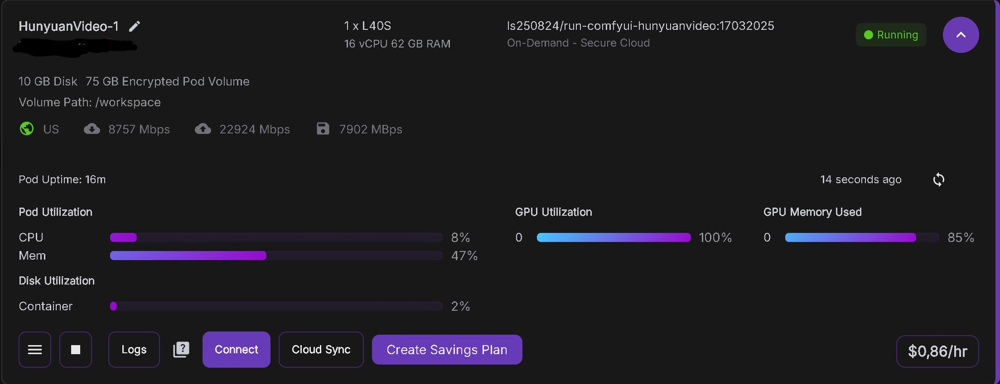
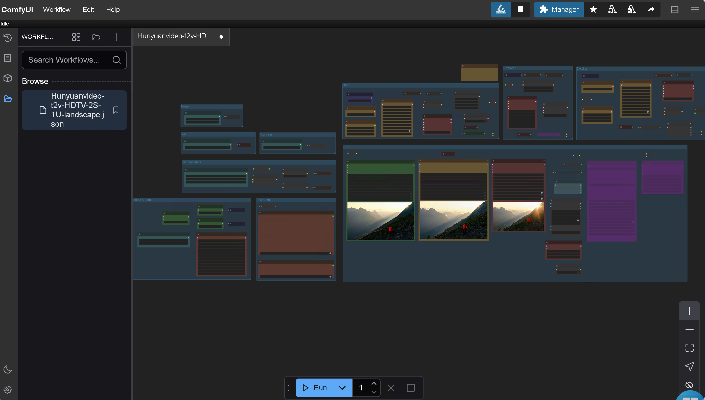

# Run ComfyUI HunyuanVideo with Custom nodes on [RunPod.io](https://runpod.io?ref=se4tkc5o)

## Synopsis

A streamlined setup for running **ComfyUI** with **HunyuanVideo** on high-performance hardware.  
This pod downloads models as specified in the **environment variables** set in the [RunPod.io template](https://runpod.io/console/deploy?template=gcg37htwu8&ref=se4tkc5o).  

- Models and loras are automatically downloaded based on the specified paths in the environment configuration.  
- Authentication credentials can be set via secrets for:  
  - **Code server** authentication (not possible to switch off) 
  - **Hugging Face** and **CivitAI** tokens for model access.  

Ensure that the required environment variables and secrets are correctly set before running the pod.
See below for options.

## Pod running on [RunPod.io](https://runpod.io?ref=se4tkc5o)



## Hardware Requirements  
 
- **Recommended GPUs**: L40S, L40, RTX 6000 Ada  
- **Storage**:  
  - **Volume**: 75GB (`/workspace`)  
  - **Pod Volume**: 10GB  

## Template [RunPod.io](https://runpod.io?ref=se4tkc5o)

- [template](https://runpod.io/console/deploy?template=gcg37htwu8&ref=se4tkc5o)

## Available Images

### Image

Base Image: ls250824/comfyui-runtime:17032025

#### Custom Build: 

```bash
docker pull ls250824/run-comfyui-hunyuanvideo:19032025
```

## Environment Variables  

### **ComfyUI Arguments**  

| Token        | Environment Variable     |
|--------------|--------------------------|
| Arguments    | `COMFYUI_EXTRA_ARGUMENTS`|

### **Authentication Tokens**  

| Token        | Environment Variable |
|--------------|----------------------|
| Civitai      | `CIVITAI_TOKEN`      |
| Huggingface  | `HF_TOKEN`           |
| Code Server  | `PASSWORD`           |

### **Diffusion Models Setup Huggingface**  

| Model Type        | Model                         | Safetensors                               |
|-------------------|-------------------------------|-------------------------------------------| 
| Diffusion Model   | `HF_MODEL_DIFFUSION`          | `HF_MODEL_DIFFUSION_MODELS_SAFETENSORS`   |
| Checkpoints       | `HF_MODEL_CHECKPOINTS`        | `HF_MODEL_CHECKPOINTS_SAFETENSORS`        |
| Text Encoders     | `HF_MODEL_TEXT_ENCODERS[1-2]` | `HF_MODEL_TEXT_ENCODERS_SAFETENSORS[1-2]` |
| VAE               | `HF_MODEL_VAE`                | `HF_MODEL_VAE_SAFETENSORS`                |
| Upscalers         | `HF_MODEL_UPSCALER[1-2]`      | `HF_MODEL_UPSCALER_PTH[1-2]`              |
| Loras huggingface | `HF_MODEL_LORA[1-4]`          | `HF_MODEL_LORA_SAFETENSORS[1-4]`          |

### **Diffusion Lora Setup CivitAI**  

| Model Type        | URL (download link)           |
|-------------------|-------------------------------|
| Loras civitai     | `CIVITAI_MODEL_LORA_URL[1-4]` |

## Connection options 

### Services

| Service         | Port          |
|-----------------|---------------| 
| **ComfyUI**     | `8188` (HTTP) |
| **Code Server** | `9000` (HTTP) |
| **SSH/SCP**     | `22`   (TCP)  |
 
## Workflows & Tutorials  

- [OpenArt.ai](https://openart.ai/workflows/home?keyword=Hunyuanvideo)  
- [CivitAI Guide](https://civitai.com/articles/9584/tips-hunyuan-the-bomb-you-are-sleeping-on-rn)  
- [Enhance a Video](https://oahzxl.github.io/Enhance_A_Video/)  
- [ComfyUI Examples](https://comfyanonymous.github.io/ComfyUI_examples/hunyuan_video/)

## Workflow

- Example Text to video workflow using available custom nodes in /workspace/ComfyUI/user/default/workflows
- Open workflow from ComfyUI's interface on the left. 



## Software Repositories  

### Core  

- [ComfyUI](https://github.com/comfyanonymous/ComfyUI)  
- [Code Server](https://github.com/coder/code-server)  
- [HuggingFace CLI Guide](https://huggingface.co/docs/huggingface_hub/v0.27.0/guides/cli) 

### Custom Nodes ComfyUI 

- [rgthree](https://github.com/rgthree/rgthree-comfy)  
- [Login](https://github.com/liusida/ComfyUI-Login)  
- [Manager](https://github.com/ltdrdata/ComfyUI-Manager)  
- [Noise Tools](https://github.com/chrisgoringe/cg-noisetools)  
- [Noise](https://github.com/BlenderNeko/ComfyUI_Noise)  
- [Video Helper Suite](https://github.com/kosinkadink/ComfyUI-VideoHelperSuite)  
- [KJNodes](https://github.com/kijai/ComfyUI-KJNodes)  
- [MultiLora Loader](https://github.com/asdrabael/Hunyuan-Multi-Lora-Loader)  
- [TeaSampler](https://github.com/facok/ComfyUI-TeaCacheHunyuanVideo)  
- [Detail Daemon](https://github.com/Jonseed/ComfyUI-Detail-Daemon)  
- [Unload Models](https://github.com/SeanScripts/ComfyUI-Unload-Model)  
- [Free Memory](https://github.com/ShmuelRonen/ComfyUI-FreeMemory)  
- [Frame Interpolation](https://github.com/Fannovel16/ComfyUI-Frame-Interpolation)  
- [HunyuanLoom](https://github.com/logtd/ComfyUI-HunyuanLoom)  
- [Python Extension](https://github.com/pydn/ComfyUI-to-Python-Extension)  

## Models

### Sources  

- [Tencent HunyuanVideo GitHub](https://github.com/Tencent/HunyuanVideo)
- [Tencent HunyuanVideo](https://huggingface.co/tencent/HunyuanVideo)  
- [Kijai HunyuanVideo](https://huggingface.co/Kijai/HunyuanVideo_comfy)  
- [Comfy-Org HunyuanVideo](https://huggingface.co/Comfy-Org/HunyuanVideo_repackaged)
- [CivitAI HunyuanVideo](https://civitai.com/models/1167575?modelVersionId=1314397)  

### Manual provisioning

- [Script](provisioning/huggingface_HunyuanVideo.md)

#### **Huggingface**  

```bash
huggingface-cli download model model_name.safetensors --local-dir /workspace/ComfyUI/models/diffusion_models/
huggingface-cli upload model /workspace/model.safetensors
```

#### **CivitAI**  

```bash
civitai "<download link>" /workspace/ComfyUI/models/diffusion_models
civitai "<download link>" /workspace/ComfyUI/models/loras
```
## 7z Compression  

### **Encrypt & Archive Output**  

```bash
7z a -p -mhe=on /workspace/output/output-hunyuanvideo-x.7z /workspace/ComfyUI/output/
```

### **Extract Archive**  

```bash
7z x x.7z
```

## **Clean Up**  

```bash
rm -rf /workspace/output/ /workspace/ComfyUI/output/ /workspace/ComfyUI/models/
```

## Utilities  

```bash
nvtop   # GPU Monitoring  
htop    # Process Monitoring  
mc      # Midnight Commander  
nano    # Text Editor  
```

## Building the Docker Image 

Not possible on [runpod.io](https://runpod.io?ref=se4tkc5o) use local hardware.
You can build and push the image to Docker Hub using the `build-docker.py` script.

### `build-docker.py` script options

| Option         | Description                                         | Default                |
|----------------|-----------------------------------------------------|------------------------|
| `--username`   | Docker Hub username                                 | Current user           |
| `--tag`        | Tag to use for the image                            | Today's date           |
| `--latest`     | If specified, also tags and pushes as `latest`      | Not enabled by default |

### Build & push Command

Run the following command to clone the repository and build the image:

```bash
git clone https://github.com/jalberty2018/run-comfyui-hunyuanvideo.git

python3 run-comfyui-hunyuanvideo/build-docker.py \
--username=<your_dockerhub_username> \
--tag=<custom_tag> \ 
run-comfyui-hunyuanvideo
```

Note: If you want to push the image with the latest tag, add the --latest flag at the end.